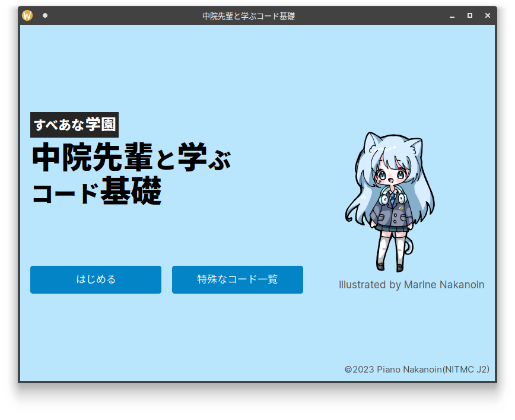
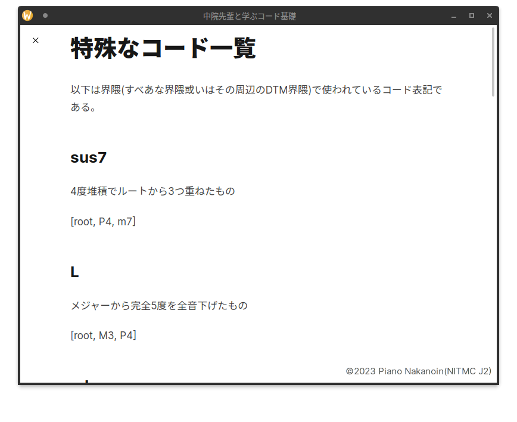
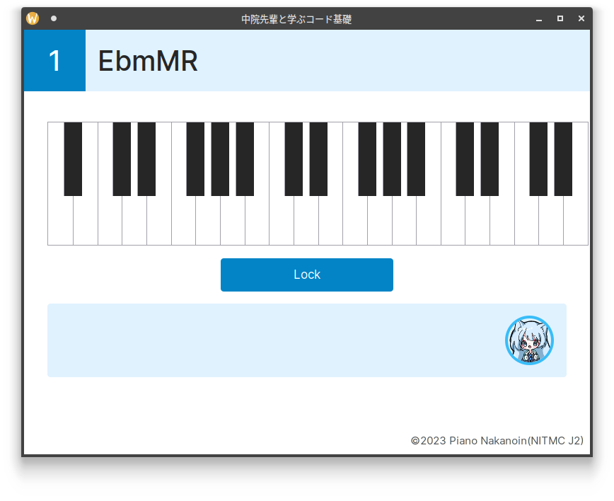
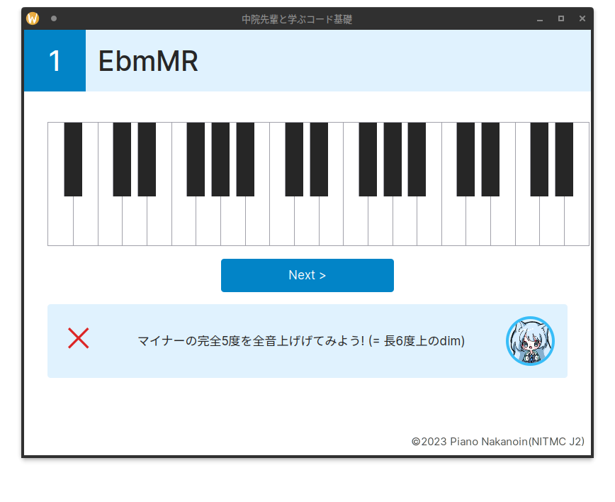
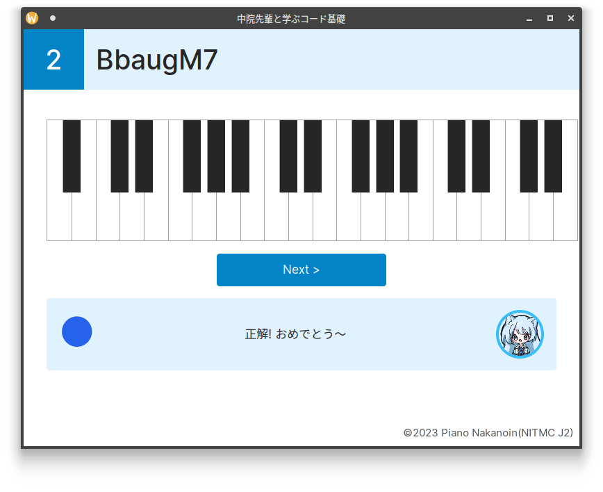
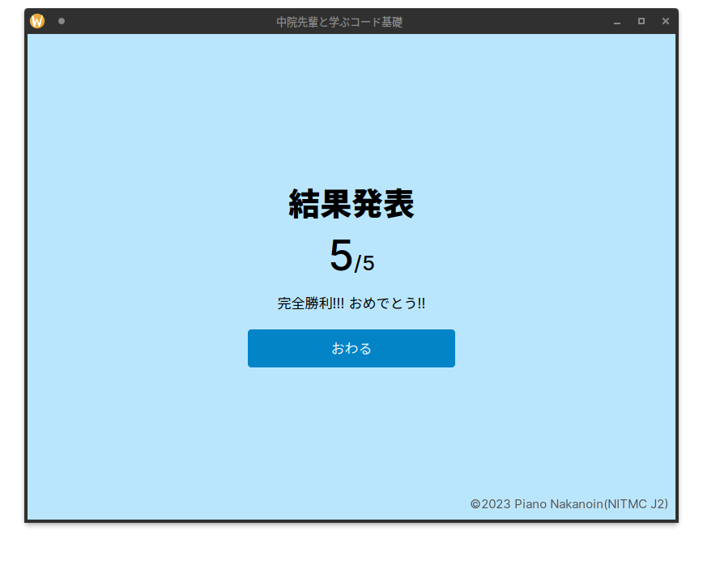

# 中院先輩と学ぶコード基礎
夏休みの課題のやつ

## Used Frameworks
- [Tauri](https://tauri.app)
- [Svelte](https://svelte.dev)
- [Vite](https://vitejs.dev)
- [Tailwind CSS](https://tailwindcss.com/)

## Howto
1. 「はじめる」をクリックします
2. 表示されたコードをピアノ鍵盤をクリックして入力します
3. 「Lock」をクリックして答えをロックし、正誤を確認します
4. 「Next」をクリックし、2-3をあと4回繰り返します
5. 「Finish」をクリックして成績を確認します
6. 「おわる」をクリックすれば終了です

## Updated
- UIの大幅変更 (よりゲームらしく)
- コードの大幅追加 (すべあな界隈/DTM界隈でしか広まっていないものも)
- タイトル画面の追加
- 中院先輩 (僕)
- 正誤が確定したらアドバイスが表示されるように
- ヘッダーの削除
- 「特殊なコード一覧」を追加

## Screenshots
Manjaro Linux(KDE, Wayland)にて撮影しています

## License
Core部分はMIT、画像はCC BY-NC-NDでお願いします

## Special Thanks
- 中院まりん (妹) ... イラスト
